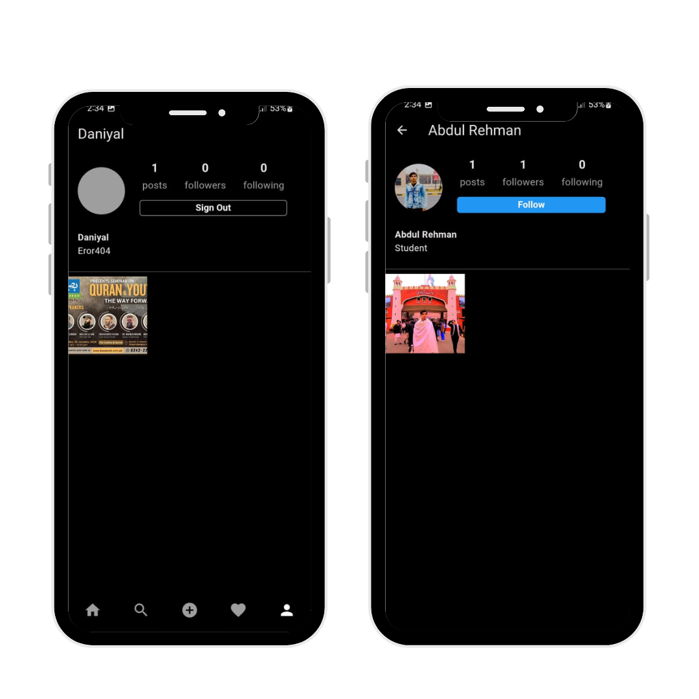

# Instagram Clone

A fully functional Instagram clone built using Flutter and Firebase. This project mimics the core functionalities of Instagram, including user authentication, photo uploads, likes, comments, and more.

## Features

- User Authentication (Sign Up, Login, Logout)
- Uploading Photos
- Liking and Commenting on Photos
- Viewing Photos in a Feed
- User Profiles
- Following/Unfollowing Users
- Real-time Updates

## Screenshots

 
